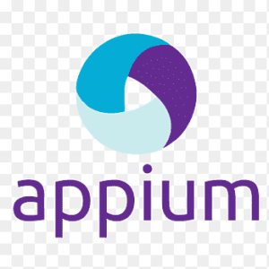
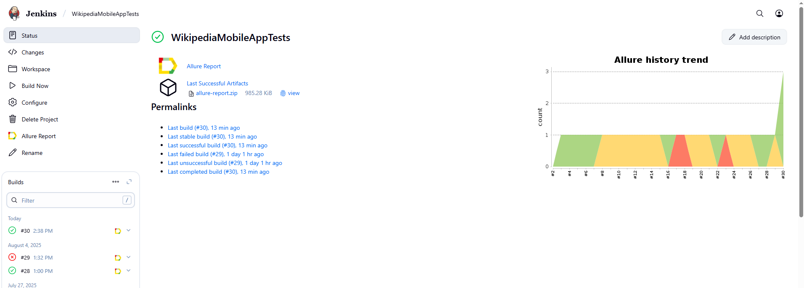
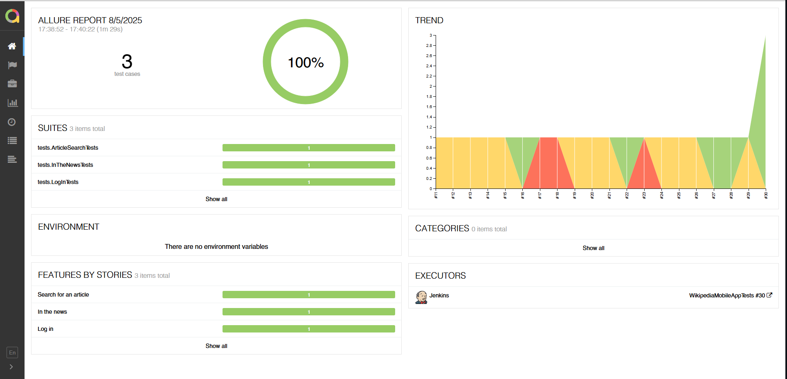
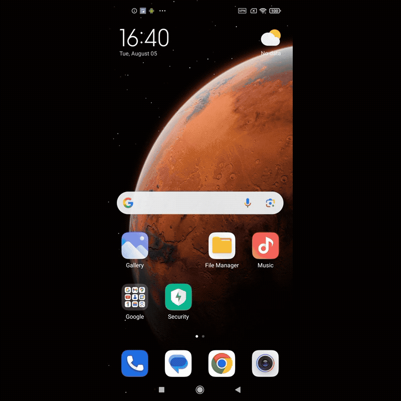
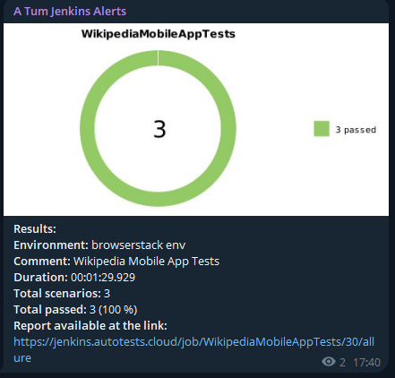

<p align="center">
  <a href="https://en.wikipedia.org/wiki/Main_Page" target="_blank">
    
  </a>
</p>

# Wikipedia Mobile App Automated Tests

## 📜 Summary
- [Stack](#-stack)
- [Automated test cases](#-automated-test-cases)
- [Build](#-build)
- [Jenkins](#-jenkins)
- [Allure report](#-allure-report)
- [Notifications](#-notifications)

  
## 💻 Stack

<div align="center">
  <table>
    <tr>
      <!-- First row -->
      <td align="center" width="110">
        <a href="https://www.java.com" target="_blank">
          
        </a>
        <br>Java 21
      </td>
      <td align="center" width="110">
        <a href="https://junit.org/junit5/" target="_blank">
          
        </a>
        <br>JUnit 5
      </td>
      <td align="center" width="110">
        <a href="https://gradle.org/" target="_blank">
          
        </a>
        <br>Gradle
      </td>
      <td align="center" width="110">
        <a href="https://selenide.org/" target="_blank">
          
        </a>
        <br>Selenide
      </td>
      <td align="center" width="110">
        <a href="https://appium.io" target="_blank">
          
        </a>
        <br>Appium
      </td>
    </tr>
    <tr>
      <!-- Second row -->
      </td>
      <td align="center" width="110">
        <a href="https://docs.qameta.io/allure/" target="_blank">
          
        </a>
        <br>Allure
      </td>
    <td align="center" width="110">
        <a href="https://rest-assured.io/" target="_blank">
          
        </a>
        <br>Rest Assured
      </td>
      <td align="center" width="110">
        <a href="https://www.jenkins.io/" target="_blank">
          
        </a>
        <br>Jenkins
      <td align="center" width="110">
        <a href="https://web.telegram.org/" target="_blank">
          
        </a>
        <br>Telegram
      </td>
    </tr>
  </table>
</div>

- Developed using **Java 21**, **JUnit**, and **Selenide**
- Built via **Gradle**
- Integrated build with **Jenkins**
- Sending notifications to **Telegram**

## ✅ Automated test cases
1. Search for an article
2. Login without password
3. Check In The News widget

## ▶️ Build

The build is parametrized. These tests can be run in the emulator and remotely in the Browserstack environment. The Parameters can be set in the `.properties` files. 

To run the tests on your emulator use:

```bash
clean test -Denv=emulator
```

To run the tests on Browserstack use:
```bash
clean test -Denv=browserstack
```

##  [Jenkins](https://jenkins.autotests.cloud/job/WikipediaMobileAppTests/)

The project is integrated with Jenkins, where the tests can be run remotely in the Browsertsatck environment.




##  [Allure report](https://jenkins.autotests.cloud/job/WikipediaMobileAppTests/30/allure/)

### Allure report page


### Each test in the report contains:
- Test steps
- Page Source
- Video of the test run
  


##  Notifications

After each run a notification is sent automatically to **Telegram** with a brief summary of the test results including the number of passed and failed tests, run duration, and report link. This functianlity is implemented using the [allure-notifications](https://github.com/qa-guru/allure-notifications) library which also allows sending notifications to Slack, Discord, and other messengers.


